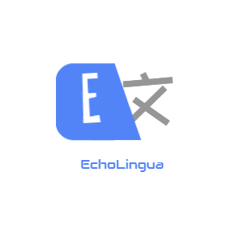
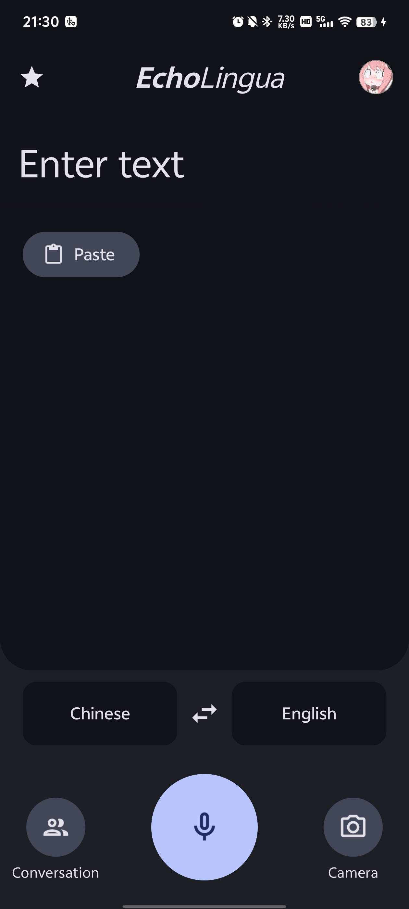
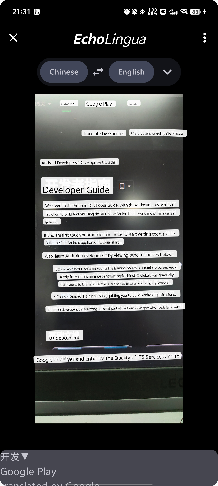
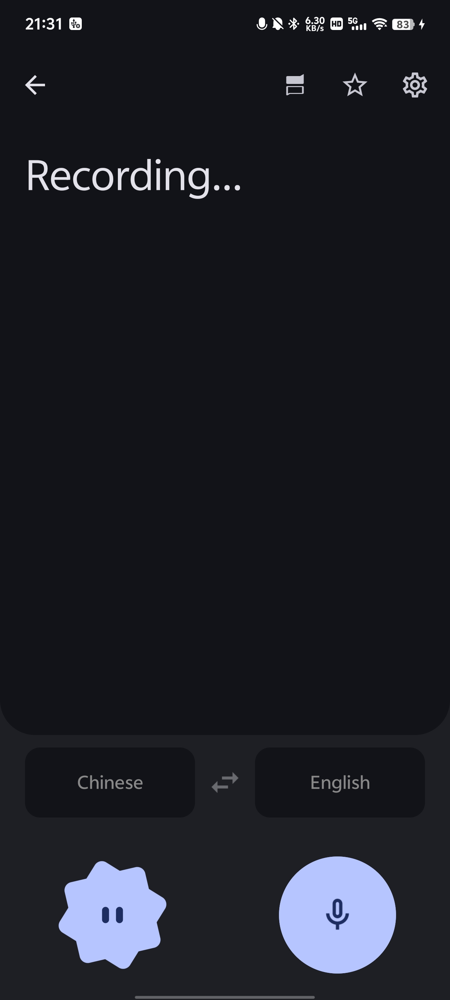
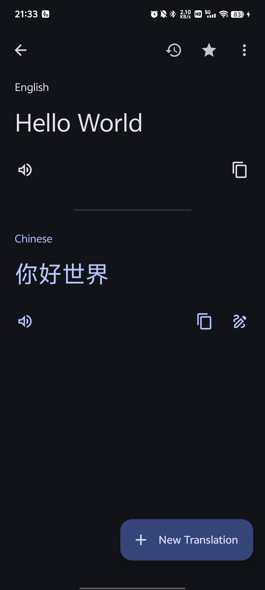
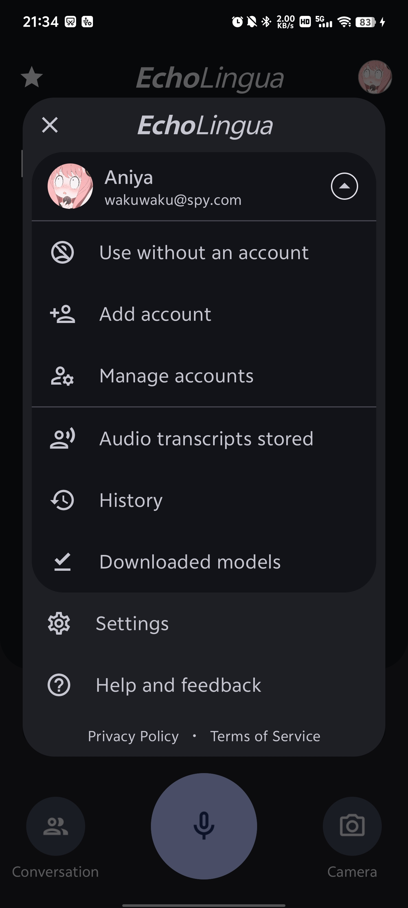
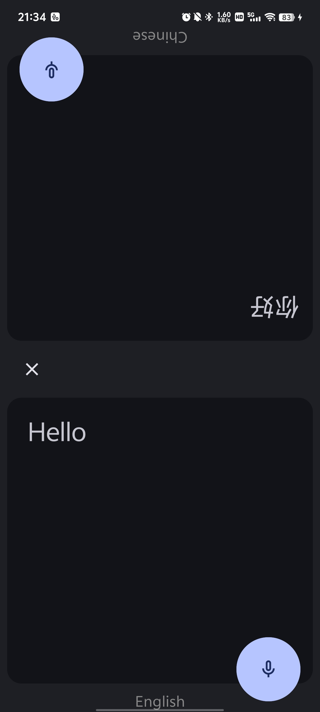
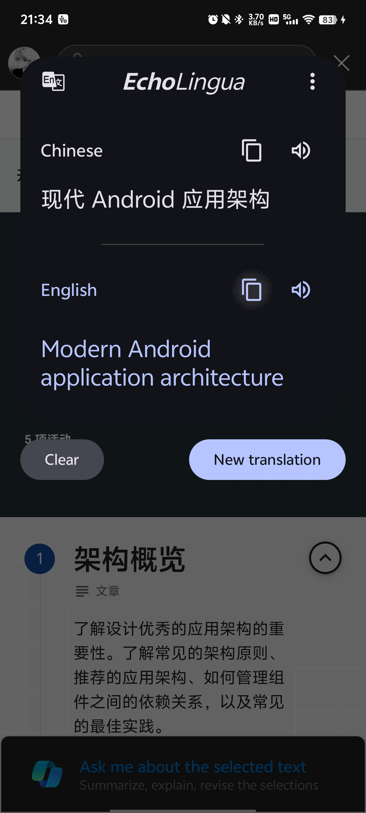
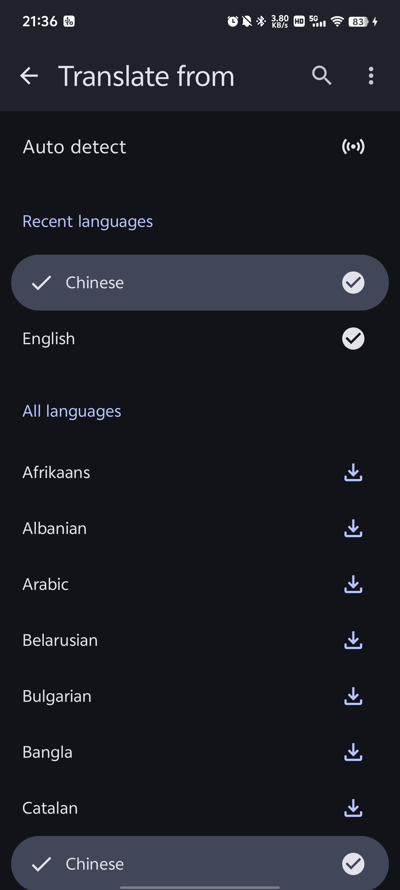

# *EchoLingua*

A translation App which looks exactly like ***Google Translate***

## Screenshots

## Features
- Offline Neural Machine Translation by [Google ML Kit](https://developers.google.com/ml-kit/language/translation)
- Offline Text Recognition by [Google ML Kit](https://developers.google.com/ml-kit/vision/text-recognition/v2)
- Offline Audio Transcribe by [whisper.cpp](https://github.com/ggerganov/whisper.cpp)
- Translate everywhere with QuickTranslatePage (also Google-like)
- Online TTS deployed on BackEnd (Offline VITS on the way)
- Translation History on the way
